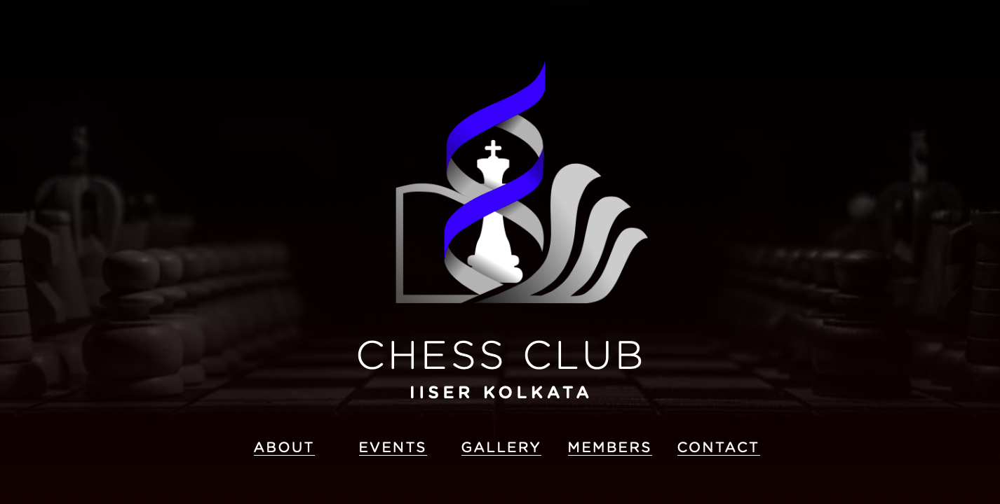

# Website for the Chess Club of IISER Kolkata
### The Chess Club acts as a hub for chess players of IISER-Kolkata, the premier research institute in India. This is the official repository for the website of same.

### [Chess Club IISER-K](https://www.iiserkol.ac.in/~chess.activity/)

### The primary vision of the club is to act as a platform for players to sharpen their skills in the game, increase their critical thinking and to promote chess in the institute and beyond.

### Feel free to pay a visit whenever you might wanna solve some puzzles, analyze some games, play or watch some online blitz, watch live broadcasts of popular grand tournaments, or even to challenge your fellow members from IISER-K. 

### Just join together, verify your guest id/ username and send a challenge request and play as many games as you like!

### Most of the embedded widgets are hosted by [Chessbase](https://en.chessbase.com/)

### Follow us on [Facebook](https://www.facebook.com/Chess-Club-IISER-Kolkata-114370200471219) and [Instagram](https://www.instagram.com/chess.club_iiserk/)